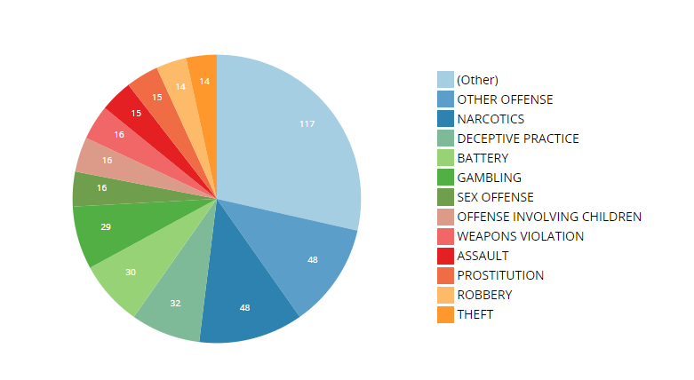
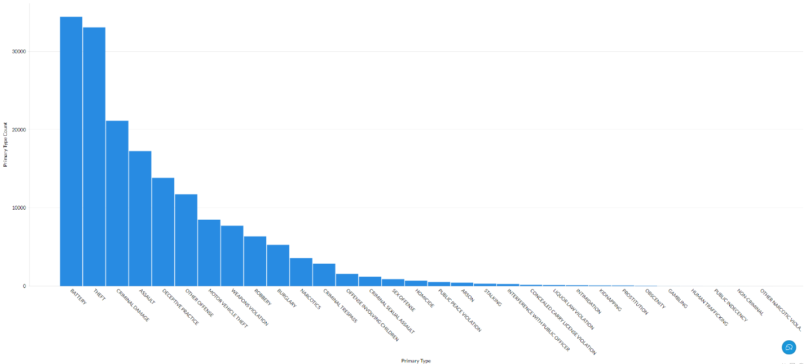
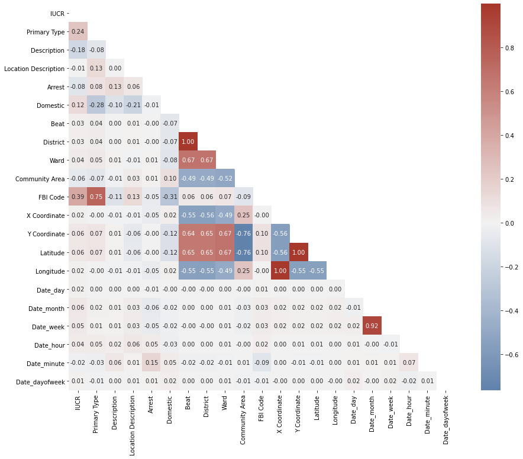

# COMP 379 Final Project Report

> Written by Nicholas Synovic, Emmanuel Amobi, Zac Neuhardt, Brian Nguyen, and Jake Palmer

## Table of Contents

- ***[COMP 379 Final Project Report](#comp-379-final-project-report)***
  - [Table of Contents](#table-of-contents)
  - [Goal](#goal)
  - [Team Contributions](#team-contributions)
  - [Background](#background)
  - [Data Pre-Processing](#data-pre-processing)
    - [Reducing Population Size](#reducing-population-size)
    - [Feature Removal](#feature-removal)
    - [Remaining Features](#remaining-features)
      - [Note on Remaining Features](#note-on-remaining-features)
    - [Correlation Matrix](#correlation-matrix)
  - [Clustering or Classification?](#clustering-or-classification)
    - *[Feature Importance with Random Forest Modeling](#feature-importance-with-random-forest-modeling)*
  - [Clustering](#clustering)
    - *[Elbow Method](#elbow-method)*
  - [Conclusion](#conclusion)

## Goal

We want to cluster Chicago crime reports based off of a variety of features.

## Team Contributions

- **Brian Nguyen** - Feature importance using a random forest model to determine what features would result in the best labels in an example classification problem; Meant to prove that clustering is the proper way of analyzing this dataset because none of the features of predictive of the labels in question
- **Jacob Palmer** - Preprocessing the dataset to reduce the feature set. Turning descriptive data into quantifiable values; Has a CSV to convert descriptions into digits
- **Emmanel Amobi** - Taking different features and creating clusters using K-means; This gets multiple different clustsers to present
- **Zac Neuhardt** - Correlating crimes across community areas; Clustering with K-means
- **Nicholas Synovic** - Working on the report and presentation

## Data Pre-Processing

### Reducing Population Size

The Chicago Crime dataset that we are using includes all crimes reported from 2001 to today minus one to two weeks. This dataset has 22 features for each of the 7,454,088 samples. To reduce the dataset into a managable size, we limited the clustering to crime that has only occurred within 2021. This reduced dataset contains the same 22 features, but now only has 191,568 samples to cluster. This represents only 2% of the total dataset. However, as our goal is to only cluster crime that has occurred during 2021, this step was necessary to obtain our results.

### Feature Removal

This dataset contained 22 features, which upon our analysis, were not needed for clustering. This is because some of the features were joins on other features, were metadata on the dataset, or were too abstract/ not indicitave for the research that w  e were doing.

The features that were removed from the processed dataset and their corresponding reasons are (in no order):

- Location
  - This is a join on the features *Latitude* and *Longitude*.
- Year
  - As we're only analyzing 2021, this is just extra information
- Case Number
  - This is an arbitrary tracking value that isn't useful for clustering
- ID
  - A unique ID associated with a report
- Block
  - One of the many crime location specifications within the document. This one was too specific to be of any use to us
  - There is was the potential for this feature to be too correlated with other location specifications, such as beat, district, and/or location
  - This information was too generic for our research, while other features (such as *X Coordinate* and *Y Coordinate*) provided the neccesary specificity to perform our calculations
- Updated On
  - This was when the crime was updated within the dataset

### Remaining Features

#### Note on Remaining Features

The processed dataset contained only the following features:

- IUCR (Illinois Uniform Crime Reporting code)
  - Within the raw dataset, there were approximately 300 unique IUCR codes
  - These codes contain both letters and numbers, which were translated into unique numbers to properly quanitify the data
  - There is a concern that IUCR codes can be too correlated with one another. We considered merging similar IUCR codes together based off of their correlated *Primary Type*, however, due to time constraints, we decided against doing so
    - See *Figure 1* to see how many IUCR codes relate to a *Primary Type*
  - More information on IUCR codes can be found [here](https://data.cityofchicago.org/Public-Safety/Chicago-Police-Department-Illinois-Uniform-Crime-R/c7ck-438e)

<figure>
    
    <figcaption align = "center"><b>Figure 1</b></figcaption>
</figure>

- Primary Type
  - This was a summarized version of the IUCR code
    - Not as specific as an IUCR code
    - Only 31 different *Primary Types* in our raw dataset
  - This data had to be encoded as well
  - See *Figure 2* to see how many crimes had a given *Primary Type* in our dataset

<figure>
    
    <figcaption align = "center"><b>Figure 2</b></figcaption>
</figure>

- Location Description
  - This feature had 125 distinct quantitative descriptions of where crimes were reported
  - Values of this feature had to be encoded
- Arrest
  - A boolean value indicating whether an arrest was made or not
- Domestic
  - Indicates whether the reported crime was a domestic incident as defined by the [Illinois Domestic Violence Act](https://www.ilga.gov/legislation/ilcs/ilcs5.asp?ActID=2100)
- Beat
  - The smallest geographic unit of police distribution
- District
  - A larger geographic breakdown of police which is a superset fo *Beat*
  - There are 22 districts in Chicago
- Ward
  - Areas broken up by city council districts
  - A map of Chicago wards can be found [here](https://data.cityofchicago.org/Facilities-Geographic-Boundaries/Boundaries-Wards-2015-/sp34-6z76)
  - *Wards* change frequently and are not good representations of Chicago's geography. However, since we have reduced the scope of this experiment to 2021, we view that this is an appropriate feature to include
- Community Area
  - Designated “community areas” of Chicago which are  broken up into a total of 77 areas
  - *Community Area* boundaries are not political (not susceptible to redistricting or red-lining/gerrymandering), so they are fairly consistent for long term collection and analysis.
  - A map of *Community Areas* can be found [here](https://data.cityofchicago.org/Facilities-Geographic-Boundaries/Boundaries-Community-Areas-current-/cauq-8yn6)
- *X Coordinates* and *Y Coordinates*
  - X and Y coordinates of the location where the crime was reported according to the [State Plane Illinois East NAD 1983 projection](https://spatialreference.org/ref/esri/nad-1983-stateplane-illinois-east-fips-1201-feet/)
    - This is essentially an isolated Latitude Longitude for the City of Chicago.
    - This is a parital location of the crime as the *X Coordinates* and corresponding *Y  Coordinates* values for a sample represent the center of the block of where an actual crime occured
- *Latitude* and *Longitude*
  - Global latitude and longitude of the crime reported
  - This is a parital location of the crime as the *Latitude* and corresponding *Longitude* values for a sample represent the corner of the nearest block of where an actual crime occured
- FBI Code
  - Crime classification as outlined in the FBI’s [National Incident-Based Reporting System](https://www.fbi.gov/services/cjis/ucr/nibrs)
  - Contains 26 unique FBI codes, similar in meaning to that of the Primary Type column
  - This data had to be encoded

Any feature that is not reported in this section but was included in the original dataset has been removed due to being too correlated with other features. See the [Correlation Matrix](#correlation-matrix) section for further information.

### Correlation Matrix

In order to better visualize what our justification for dropping certain features, we created a pairwise correlation analysis matrix.

This shows the correlation values between different features. If features are heavily correlated, then they are essentially linked and therefore having all of the correlated features is redundant.

For instance, *Latitude* and *Y Coordinate* (as well as *Longitude* and *X Coordinate*) both have a correlation value of 1.0. This means that they are completely linked features, and having both in the clustering algoirthm will, at best, be mute.

It also shows to drop either beat or district, as they also have a 1.0 correlation value. Further, as expected, the *FBI Code* is heavily correlated with the *Primary Type* (since they pretty much say the same thing).

See *Figure 3* for an image of our Correlation Matrix.

<figure>
    
    <figcaption align = "center"><b>Figure 3</b></figcaption>
</figure>

## Clustering or Classification?

Upon forming the initial analysis question for this dataset, we had a decision to make of whether we would analyze it from the perspective of a classification or clustering problem. Simply looking at the raw dataset itself, it was clear that the majority of features were nominal and categorical, which does not necessarily make it a great fit for quanititative analysis by nature.

### Feature Importance with Random Forest Modeling

By utilizing a random forest model, we chose to perform an sample classification analysis to get an idea of the relative importance each feature might have in terms of prediction importance. With the *Arrest* feature as the dependent variable and all others as the independent variables, it seemed that the most important predicting features were the *Description*, *IUCR*, and *Primary Type* of a select row (see *Figure 4*). Upon first thought, this made intuitive sense as whether an arrest was made could definitely be influenced by what kind of crime was commited.

However, after the first inital top three features there was a significant drop off in importance scores. Taking a look at two of the features with lesser importance respectively, *Date_minute* and *Date_hour*, the analysis seemed to falter in reasonable logic as there is no valid reason why the minute of an hour would reflect more importance than the hour of the day an arrest might be made (see *Figure 5*). An explanation for this discrepency in logic might be attributed to the fact that there are simply more numerical values in minutes measurement (60 possible values) as compared to hours (24 possible values).

Because of the seemingly illogical analysis of a classification model on our dataset, we opted to perform an exploratory clustering analysis instead to discover if there are any interesting groupings to be had.

<figure>
    
    <figcaption align = "center"><b>Figure 4</b></figcaption>
</figure>

<figure>
    
    <figcaption align = "center"><b>Figure 5</b></figcaption>
</figure>

## Clustering

### Elbow Method

## Conclusion
