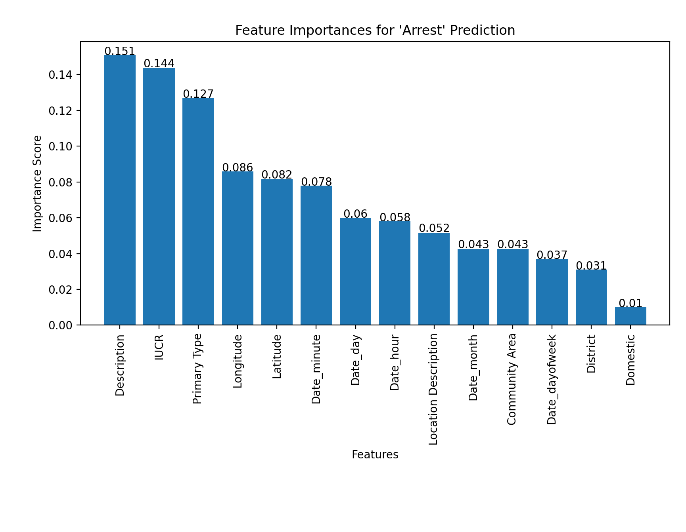
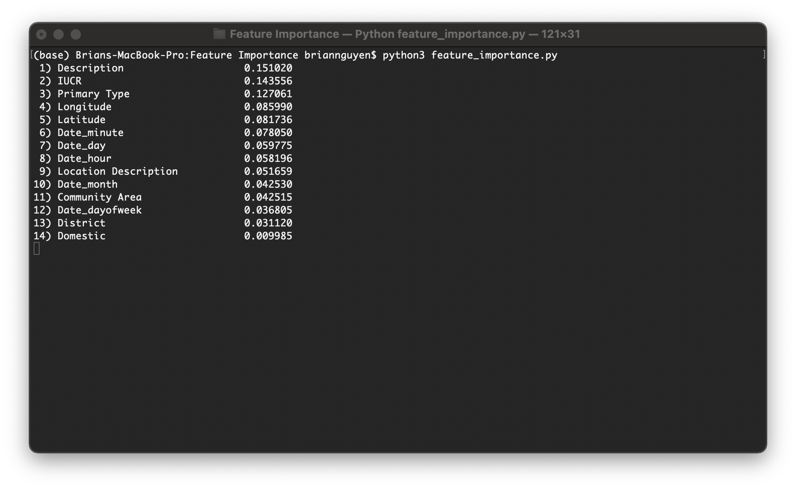

# COMP 379 Final Project Report

> Written by Nicholas Synovic, Emmanuel Amobi, Zac Neuhardt, Brian Nguyen, and Jake Palmer

## Table of Contents

- ***[COMP 379 Final Project Report](#comp-379-final-project-report)***
  - [Table of Contents](#table-of-contents)
  - [Goal](#goal)
  - [Team Contributions](#team-contributions)
  - [Background](#background)
  - [Data Preperation](#data-preperation)
  - [Clustering or Classification](#clustering-or-classification)
    - *[Feature Importance with Random Forest Modeling](#feature-importance-with-random-forest-modeling)*
      - *[Discovery](#discovery)*
  - [Clustering](#clustering)
    - *[Elbow Method](#elbow-method)*
  - [Conclusion](#conclusion)

## Goal

Cluster analysis of what features best determine if an incident resulted in an arrest or not. Goal is to find interesting relationships between features and labels

## Team Contributions

- **Brian Nguyen** - Feature importance using a random forest model to determine what features would result in the best labels in an example classification problem; Meant to prove that clustering is the proper way of analyzing this dataset because none of the features of predictive of the labels in question
- **Jacob Palmer** - Preprocessing the dataset to reduce the feature set. Turning descriptive data into quantifiable values; Has a CSV to convert descriptions into digits
- **Emmanel Amobi** - Taking different features and creating clusters using K-means; This gets multiple different clustsers to present
- **Zac Neuhardt** - Correlating crimes across community areas; Clustering with K-means
- **Nicholas Synovic** - Working on the report and presentation

## Background

## Data Preperation

In order to better visualize what I was discussing today and our justification for dropping certain features, I created a pairwise correlation analysis matrix. Basically, it shows the correlation values between different features. If they are heavily correlated, it just means that the features are essentially linked and therefore it is redundant to have both. For instance, a good example is Latitude and Y-coordinate (and vice versa with X and longitude). They both have a correlation value of 1.0 which is essentially completely linked features, which is expected as the x-y coordinates are essentially remapped latitude and longitude. It also shows, as we agreed, to drop either beat or district, as they also have a 1.0 correlation value. I think for the final dataset, I'll go ahead and keep District and Community Area as they dont seem to be that correlated so could be interesting to see what's up there. Further, as we expected, the FBI code is heavily correlated with the Primary Type (since they pretty much say the same thing) so I'd say since our scope is just Chicago, we should remove the FBI code.

I went ahead and converted pretty much all the columns I could to a quantifiable integer value and will upload that file with less columns dropped incase anyone wants to mess around with it. For the simplified dataset, I will go ahead and drop the columns we discussed. I did, however, format the date to be a readable format and separated it into Date_day (day of the year out of 365), Date,month, Date_week (out of the year), Date_hour, Date_minute, and Date_dayofweek (Monday - Sunday mapped to integer values). I'll likely remove the Date_week as it essentially says the same thing as Date_month, as seen in the correlation matrix.

My idea here was to create a more simplified dataset that you all can just use as well as provide you with one that has more columns that might turn out to be fruitful incase you want to mess around with that too. I'm going to run a few more tests then I should have these csvs and python scripts uploaded tonight. Let me know if yall have any questions in the meantime!

## Clustering or Classification

### Feature Importance with Random Forest Modeling

#### Discovery

## Clustering

### Elbow Method

## Conclusion
